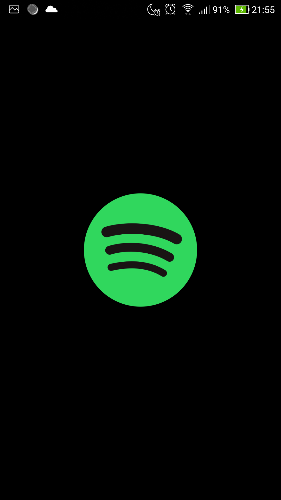
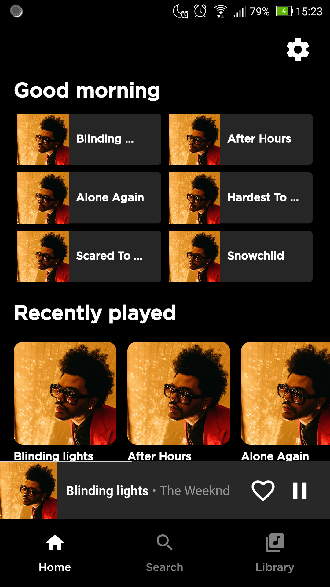
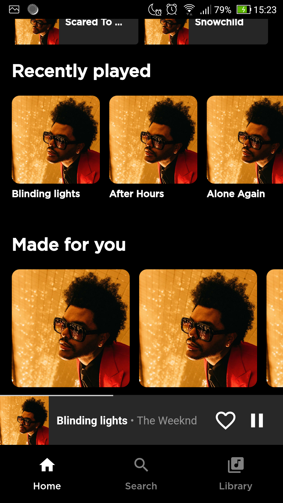
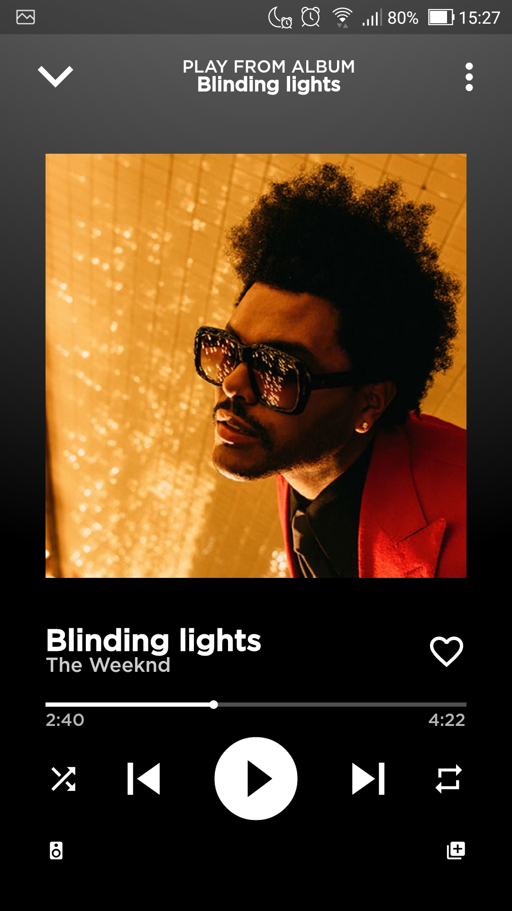
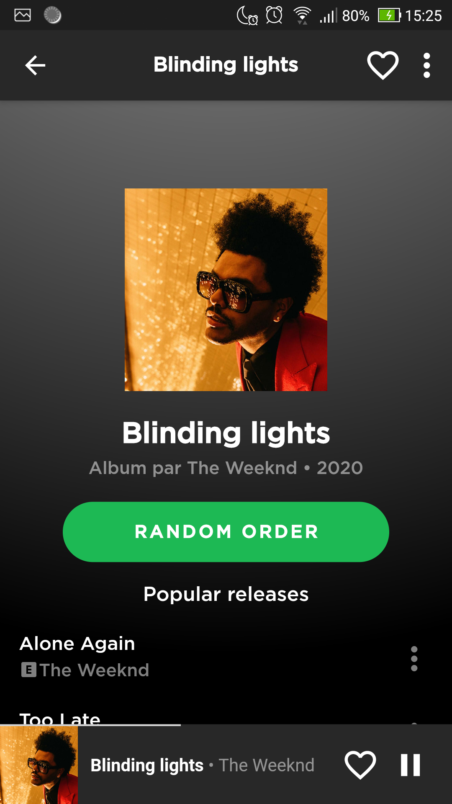
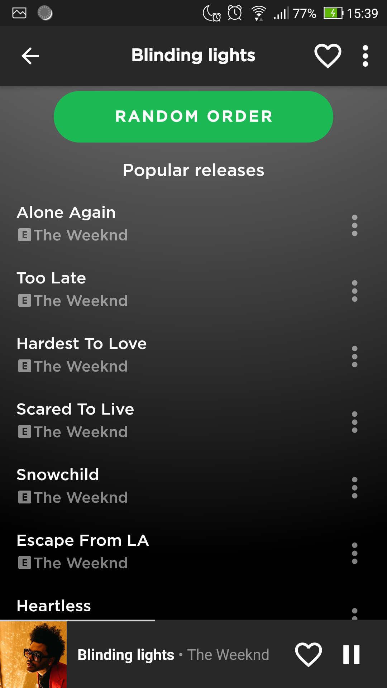

# Flutter-Spotify
💻💻 Building a Spotify Clone in Flutter for study purposes.

***

## Development

To run this project on your own, do the following: 
1. Clone this project.
2. Access the path `Flutter-Spotify/spotify`.
3. Run `flutter pub get`.
4. Run the project using `flutter run` or using your IDE's tools.
***

## Screenshots
|     |     |     |
| :-: | :-: | :-: |
| SplashScreen | Home Page | Home Page |
|  |  |  |
| Music Page | Album Page | Album Page |
|  |  |  |
