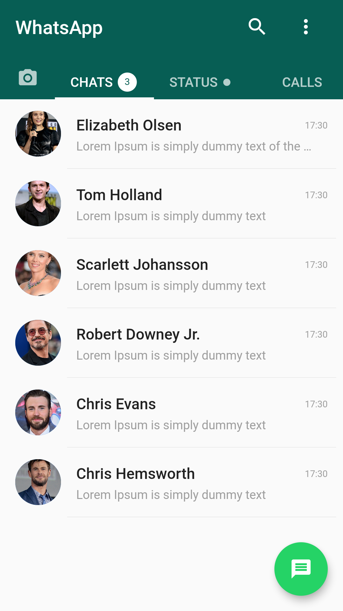
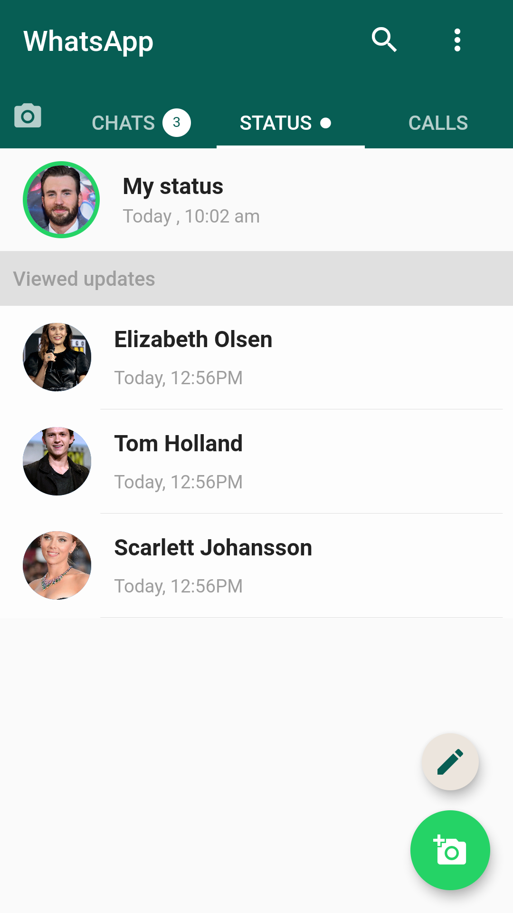
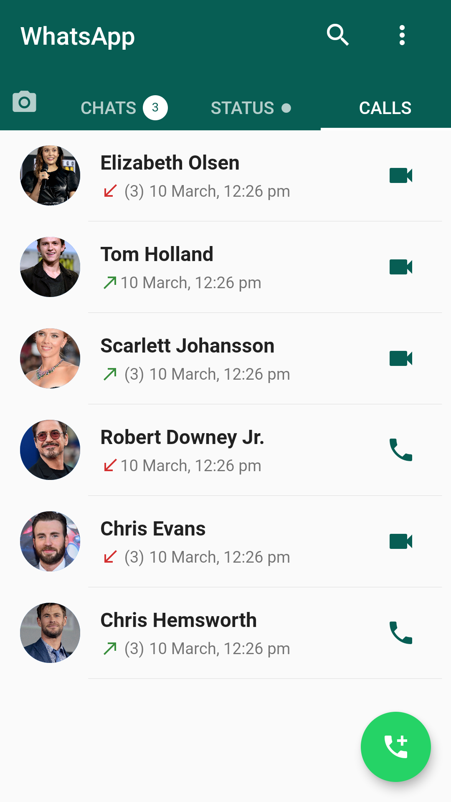
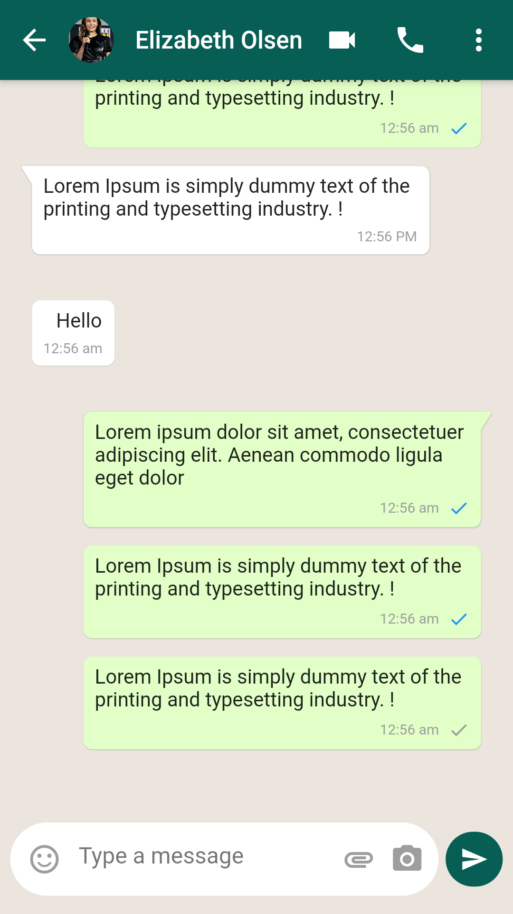
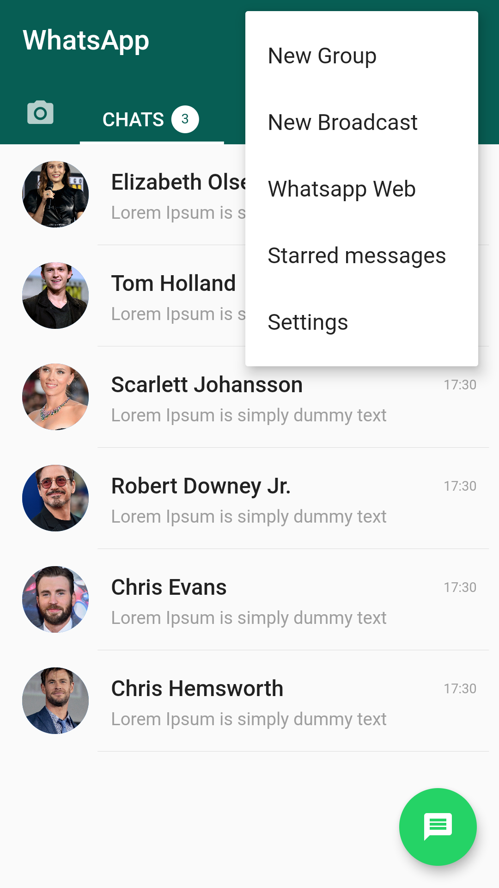
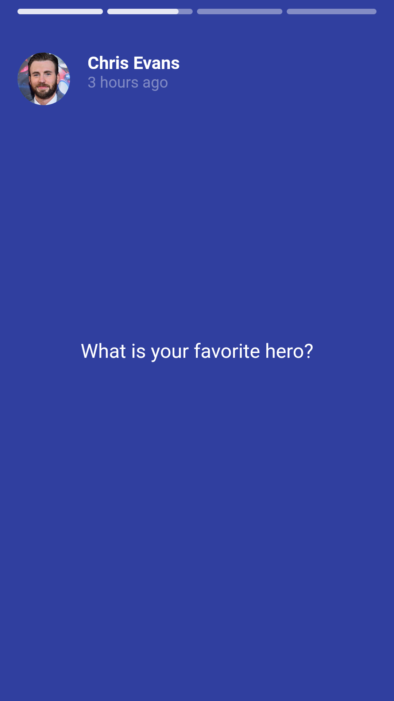
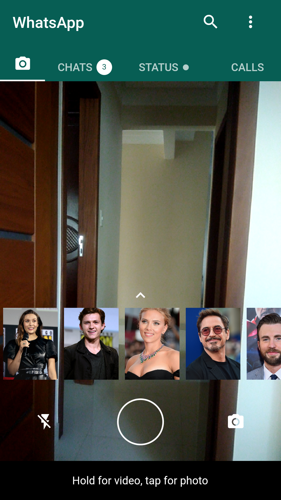

# Flutter-Whatsapp
💻💻 Building a WhatsApp Clone in Flutter for study purposes.

***

## Development

To run this project on your own, do the following: 
1. Clone this project.
2. Access the path `Flutter-Whatsapp/whatsapp`.
3. Run `flutter pub get`.
4. Run the project using `flutter run` or using your IDE's tools.
***

## Screenshots
|     |     |     |
| :-: | :-: | :-: |
| SplashScreen | Chats Page | Status Page |
|  |  |  |
| Calls Page | Talk Page | Options |
|  |  |  |
| Story 1 | Story 2 | Camera Page |
|  |  |  |
